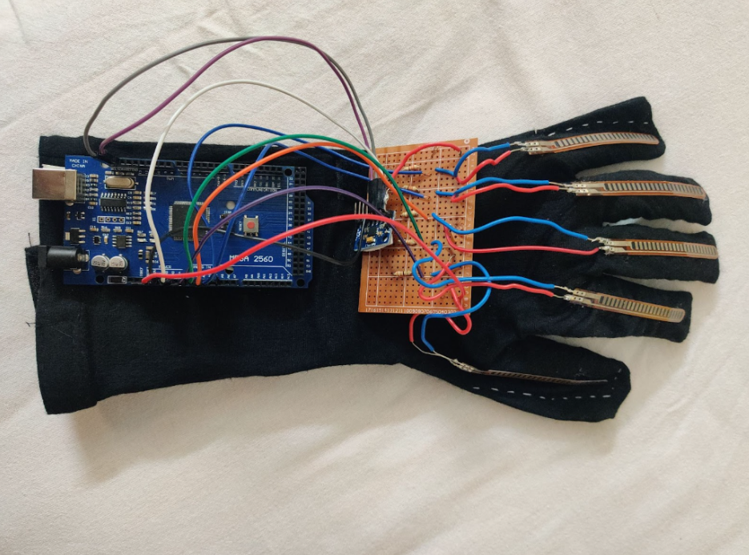
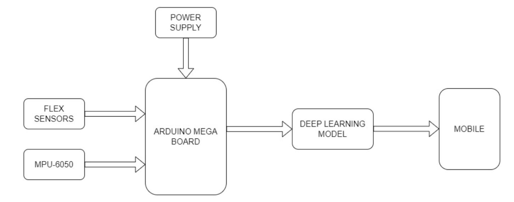
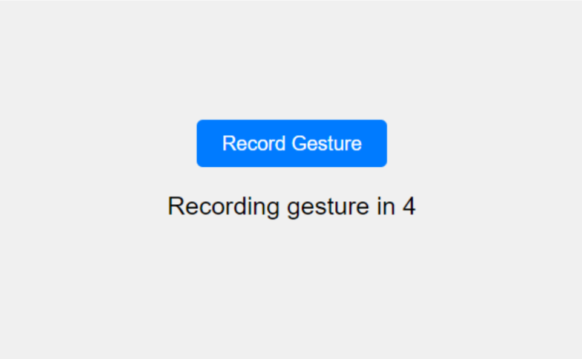
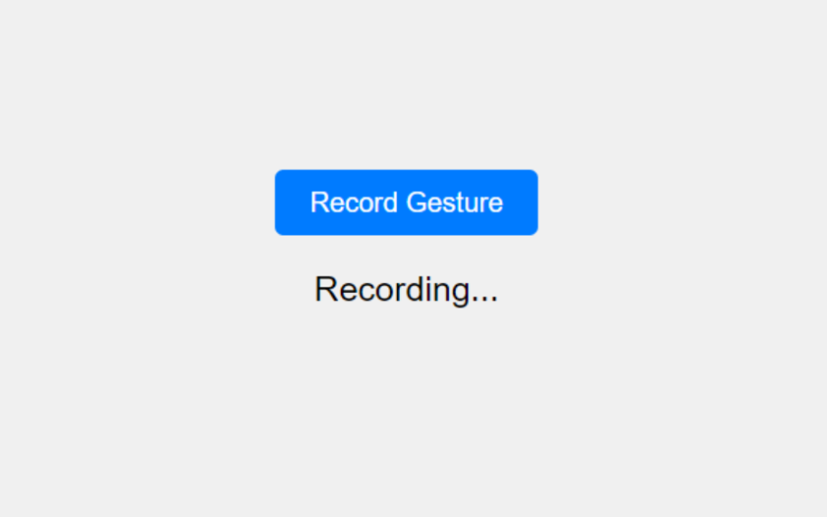

# Gesture Vocalizer – Bridging Communication Through Technology

[](https://www.arduino.cc/)
[](https://www.python.org/)
[](https://www.tensorflow.org/)
[](https://opensource.org/licenses/MIT)


## Overview

The **Gesture Vocalizer** project empowers individuals with **speech and hearing impairments** by translating **hand gestures into speech or text output**.  
By combining **flex sensors**, **accelerometers**, and **deep learning models**, this wearable system bridges the communication gap — enabling real-time gesture-to-voice translation.

<p align="center">
  
  <br>
  <em>Fig 1. Glove</em>
</p>


## Proposed Design

The design phase focuses on translating the identified problem into a **functional, wearable prototype** that captures, processes, and vocalizes gestures.

<p align="center">
  
  <br>
  <em>Fig 2. Proposed Flow</em>
</p>


### Hardware Design

#### 1. Arduino Mega Microcontroller  
- Acts as the computational hub with multiple I/O pins.  
- Handles real-time sensor integration and data transmission.

#### 2. Flex Sensors  
- Five sensors attached to a glove detect finger bending through resistance changes.  
- Provide continuous analog data reflecting hand posture.

#### 3. MPU-6050 Accelerometer  
- Measures acceleration and angular velocity to capture spatial orientation.  
- Enhances motion precision and dynamic gesture recognition.

#### Hardware Design Workflow

1. **Sensor Integration:** Connect flex sensors to Arduino analog pins.  
2. **MPU-6050 Integration:** Interface via I2C to capture acceleration and rotation.  
3. **Power Supply:** Powered through USB to ensure stable operation.  


## Software Design

### 1. Neural Network  
- Implements a **Bi-directional LSTM** for gesture recognition.  
- Processes sequences of sensor readings to identify dynamic and static gestures.  
- Trained using a **custom dataset** for enhanced accuracy.

### 2. Custom Dataset  
- Captures 3-second intervals of sensor data per gesture.  
- Combines flex sensor and MPU-6050 outputs into a single input vector.  
- Stored in CSV format for efficient model training and testing.

### 3. User Interface  
- A simple **Python-based UI** displays recognized gestures in real time.  
- Enables recording of new gesture data and live model inference.

<p align="center">
  
  <br>
  <em>Fig 3. User Interface</em>
</p>

<p align="center">
  
  <br>
  <em>Fig 4. User Interface</em>
</p>

<p align="center">
  
  <br>
  <em>Fig 5. User Interface</em>
</p>

## Implementation

### Algorithm Overview

#### Initialization
- Define analog pins for flex sensors (A0–A4).  
- Initialize MPU6050 and set up I2C communication.  

#### Setup Function
- Begin serial communication and initialize all sensors.  
- Configure pin modes for flex sensors.

#### Loop Function
- Read analog flex sensor data.  
- Capture accelerometer and gyroscope readings.  
- Print all data to the serial monitor for real-time observation.


## Installation & Setup

### 1. Clone the Repository
```bash
git clone https://github.com/username/gesture-vocalizer.git
cd gesture-vocalizer
```
### 2. Install Python Dependencies
```bash
pip install -r requirements.txt
```

### 3. Upload Arduino Script
Use the Arduino IDE to upload the .ino file to your Arduino Mega board.

### 4. Run the Application
``` bash
python app.py

```

## Achievements
- Our research was **published** in the *Journal of Electrical Systems*, Vol. 20, No. 10s (2024).  
- We obtained a **copyright** for our novel dataset.


## Contributors
- [Urav Dalal](https://github.com/Urav-Dalal)
- [Mahek Upadhye](https://github.com/mahekupadhye31)
- [Aasmi Thadhani](https://github.com/aasmithadhani)
- Shreya Shah
